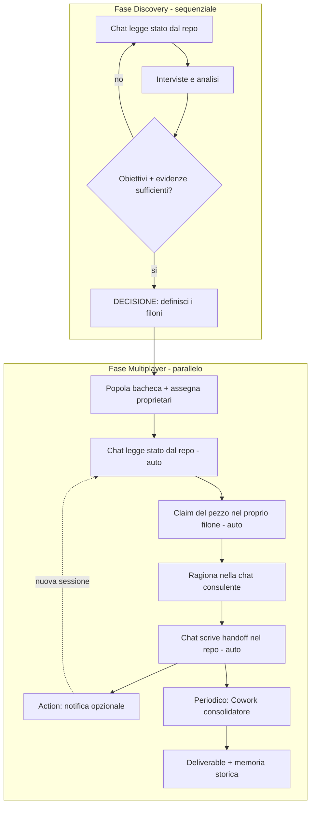

# Protocollo Knowledge-Ops Rhei — v1.2 (flusso automatico)

> Documento operativo. Vive nel repo condiviso ed è la fonte del proprio aggiornamento.
> Ultimo aggiornamento: 2026-07-24
> Modello riusabile a ruoli generici. Il bootstrap manuale resta il fallback finché il connettore non è configurato (vedi §14).

---

## 1. Scopo e principio

Lavoro **asincrono a più mani** sullo stesso progetto, con continuità e senza ridondanze. Principio unico:

> **La memoria del progetto vive nei file versionati, non nelle memorie private dei singoli Claude.**

Novità della v1.x: il passaggio di quei file **è automatico**. Il repository è il bus centrale; la chat consulente lo legge e ci scrive da sola tramite connettore. Sparisce il copia-incolla tra chat e Cowork.

---

## 2. Ruoli

Ruoli, non persone (così il modello è riusabile su qualsiasi progetto).

| Ruolo | Cosa fa |
|---|---|
| **Contributore** | Ragiona nella propria chat consulente; il suo lavoro entra ed esce dal repo in automatico. Ce ne sono N. |
| **Orchestratore** | Un solo contributore che riveste anche il ruolo di consolidatore: gira l'unico Cowork che riconcilia e produce i deliverable. |
| **Owner della Discovery** | Un solo contributore che conduce la fase iniziale finché i filoni non sono definiti. |

---

## 3. Le due vite di un progetto: Discovery → Multiplayer

Un progetto non nasce parallelizzabile.

| | **Discovery** | **Multiplayer** |
|---|---|---|
| Struttura | filoni non ancora definiti | filoni definiti, con proprietario |
| Modo | **sequenziale, una voce sola** | **parallelo, a più mani** |
| Rischio se sbagliato | parallelizzare qui **crea** ridondanze | non dichiarare i claim ricrea ridondanze |

Il passaggio è una **decisione esplicita** (definizione dei filoni) registrata in `STATO_LAVORI.md`. I filoni sono spesso un *output* della Discovery, non un input.

**Filone** = flusso di lavoro autonomo (il "cosa"); **proprietario** = chi ne è responsabile (il "chi").

---

## 4. Architettura automatica

Il repository è l'hub. Tutto vi si connette; nessuno parla direttamente con nessun altro.

| Componente | Ruolo | Quanti |
|---|---|---|
| **Progetto Claude condiviso** | Il livello "consulente": fornisce linee guida, skill e documenti stabili; **è qui che i contributori aprono le proprie chat** | uno |
| **Repository condiviso** | Bus centrale e fonte di verità viva | uno |
| **Chat consulente + connettore repo** | Dove si ragiona; legge lo stato e scrive l'handoff nel repo, in automatico | una per contributore |
| **CI / Actions** | Glue: validazioni e (opzionale) notifica al team a ogni push | — |
| **Cowork consolidatore** | Riconcilia ridondanze, genera il deliverable | uno solo (orchestratore) |
| **Cowork gemello** | *Opzionale*: solo per esecuzione locale pesante che la chat non fa | a richiesta |

**Le chat vivono dentro il progetto condiviso.** Ogni contributore apre le proprie conversazioni *dentro* il progetto Claude condiviso, ereditando così istruzioni, linee guida e skill comuni senza ricaricarle. Ma: le **chat restano private** (la condivisione riguarda istruzioni e documenti, non i thread) e le **memorie sono per-utente**. È proprio per questo che il ragionamento condiviso non può viaggiare tramite chat o memorie: deve passare dai file nel repo.

**Cambio chiave rispetto al bootstrap manuale:** poiché la chat legge/scrive il repo da sola, il Cowork gemello per-contributore non serve più. I contributori restano in chat. Cowork è solo dell'orchestratore, per consolidare.

Perché il ponte funziona: i connettori remoti girano sul cloud di Anthropic e funzionano identici su chat, Desktop e Cowork. Lo stesso repo è raggiungibile sia dalla chat sia da Cowork: è il connettore condiviso a fare da ponte, non un tubo diretto tra i due.

### Cosa vive dove

| | **Progetto Claude condiviso** | **Repository condiviso** |
|---|---|---|
| Cosa contiene | linee guida durevoli · skill ufficiali · documenti stabili di riferimento | `STATO_LAVORI` · `LAVORI_IN_CORSO` · sessioni · bozze · deliverable |
| Natura | stabile / comune — dove si **ragiona** | vivo / collettivo — lo **stato** |
| Aggiornamento | manuale, raro | automatico (dalla chat via connettore) |
| Chat | i contributori aprono qui le loro chat (private) | — |
| Memoria | per-utente (privata) | file versionati = memoria istituzionale |

Regola pratica: se una cosa **cambia spesso**, va nel repo, non nella knowledge del progetto. Caricare `STATO_LAVORI.md` come documento di progetto creerebbe uno snapshot statico da aggiornare a mano per tutti, in conflitto con il repo sempre corrente.

---

## 5. Come circola la memoria (automatica)

1. **Inizio sessione** — La chat legge `STATO_LAVORI.md` e la bacheca dal repo via connettore (equivalente automatico di pull + allega).
2. **Fine sessione** — La chat scrive l'handoff nel repo via connettore: **append** a `STATO_LAVORI.md` o apertura di una **PR** (mai force-push).
3. **(Opzionale) Notifica** — Il push fa scattare un'Action che avvisa il team sul canale scelto.

La memoria continua a passare **attraverso i file**; scrittura e lettura sono hands-free.

---

## 6. Struttura del repository

```
/progetto
├── 00_guida/               # linee guida durevoli (sola lettura)
├── 10_lavori_in_corso/     # bozze e materiali di sessione (incl. interviste Discovery)
├── 20_deliverable/         # output consolidati da Cowork
├── .github/workflows/      # Actions: validazioni, notifica opzionale
├── STATO_LAVORI.md         # memoria storica: deciso / aperto / prossimo passo
├── LAVORI_IN_CORSO.md      # bacheca claim
└── README.md               # questo protocollo
```

Tutto in **markdown**. Il .docx si genera solo come deliverable finale in `20_deliverable/`.

---

## 7. Il ciclo di sessione

### 7.a Discovery (sequenziale, un proprietario)
1. La chat legge lo stato dal repo (auto)
2. Conduci/analizza (es. interviste); i materiali grezzi finiscono in `10_lavori_in_corso/`
3. A fine sessione la chat aggiorna `STATO_LAVORI.md` (auto). "Prossimo passo" resta *"definire i filoni"* finché non lo sono
4. Quando obiettivi + evidenze bastano: **definisci i filoni**, registrali nel blocco `Deciso`, popola la bacheca, assegna i proprietari → si apre il Multiplayer

### 7.b Multiplayer (parallelo, più mani)
1. La chat legge lo stato dal repo (auto)
2. Prende in carico un pezzo **non ancora preso** nel proprio filone, aggiorna la bacheca (auto)
3. Ragiona nella chat consulente → **decisione + brief**
4. A fine sessione la chat scrive l'handoff nel repo (auto) → notifica opzionale
5. **Consolidamento periodico (orchestratore):** il Cowork consolidatore legge il repo, riconcilia e scrive il deliverable in `20_deliverable/`



---

## 8. Automazione — dettagli e regole

**Il bus a connettore condiviso.** Chat e Cowork non si parlano direttamente: entrambi raggiungono lo stesso repo tramite connettore. È questo a rendere il passaggio automatico.

**CI / Actions come glue.** Al push di un file di handoff, un'Action può validare (es. che `STATO_LAVORI.md` sia stato toccato) e, **opzionalmente**, notificare il team. Il canale di notifica è una scelta libera (Slack, email, o altro): l'automazione regge anche **senza** alcuna notifica.

**Scritture scopate.** La chat scrive solo in *append* o via *PR*, mai force-push: una scrittura mal-scopata può sovrascrivere lavoro altrui. Limitare i permessi del connettore di conseguenza.

**Governance.** Sui piani Team solo gli Owner aggiungono un connettore; poi ciascun utente si collega individualmente (le memorie restano private). Gli MCP locali non sono disponibili in chat né in Cowork: usare solo connettori remoti.

---

## 9. Gestione delle sovrapposizioni — quattro strati

| Tipo | Chi lo gestisce |
|---|---|
| Sequenzialità in Discovery | il protocollo (non si parallelizza finché non ci sono filoni) |
| Collisione dura (stesso file) | git — conflitto al merge |
| Ridondanza soft (file diversi) | Cowork consolidatore — riconcilia a valle |
| Prevenzione a monte | bacheca claim + filoni con proprietario + Action che segnala filoni fermi |

---

## 10. Prompt-integratore per il Cowork consolidatore

```
Sei l'integratore del progetto [Nome].

1. Leggi tutti i file in 10_lavori_in_corso/ e STATO_LAVORI.md.
2. Confronta i contributi delle diverse persone: individua sovrapposizioni
   concettuali, ridondanze e contraddizioni.
3. Elenca in "⚠️ Da riconciliare" ogni punto in cui due contributi dicono la
   stessa cosa in modo diverso o si contraddicono, citando i file.
4. Elenca in "❓ Da chiarire" ciò che è ambiguo: NON risolverlo tu.
5. Proponi una versione consolidata e lineare del documento di progetto, senza
   duplicazioni, coerente con le decisioni in STATO_LAVORI.md. Salvala in 20_deliverable/.
6. Segnala i filoni fermi: pezzi dichiarati nella bacheca ma senza avanzamento nei file.
7. Aggiorna STATO_LAVORI.md con una riga di log del consolidamento.

Vincolo: non inventare decisioni non presenti nei file.
```

---

## 11. Regole d'oro

1. **Non parallelizzare in Discovery.**
2. **Claim prima di lavorare** — la bacheca si aggiorna *prima* di iniziare.
3. **Handoff a ogni fine sessione** — la chat lo scrive nel repo. È l'anello critico: senza, per gli altri quel lavoro non esiste.
4. **Scritture in append o PR**, mai force-push.
5. **Il consulente tiene solo il durevole**; lo stato vive nel repo.
6. **Un solo consolidatore.**

---

## 12. Scalabilità

- **Un progetto = un consolidatore = un repo.** Non gonfiare un progetto unico: replica il pattern.
- **Filoni con proprietario** = leva anti-sovrapposizione quando il team cresce.
- **Il flusso automatico scala meglio del manuale**: aggiungere un contributore = accesso al progetto condiviso + al connettore, non configurargli un Cowork.
- La Fase Discovery è **generalizzabile** a ogni progetto che parte da un assessment.

---

## 13. Limiti noti

- **Ambito di scrittura della chat via connettore**: verificare in concreto cosa il connettore consente di scrivere (file, PR, issue) e scopare i permessi. Se la scrittura diretta non fosse affidabile, si ricade sul gemello di scrittura del bootstrap manuale.
- La knowledge del progetto **condiviso** non ha sync automatico (connettore Drive live solo su progetti privati): il durevole si ricarica a mano, di rado.
- Le automazioni aggiungono parti mobili: un'Action o un connettore che fallisce va monitorato.
- L'affidabilità resta legata alla disciplina di handoff, non alla tecnologia.

---

## 14. Percorso di adozione

1. **Bootstrap manuale:** parti senza connettori — allegando lo stato a mano e scrivendo l'handoff a mano. Valida il *protocollo* prima dell'automazione.
2. **Attiva il bus:** Owner aggiunge il connettore repo; ciascuno si collega; la chat inizia a leggere/scrivere.
3. **Attiva le Actions:** prima le validazioni, poi (se serve) la notifica.
4. **Semplifica:** rimuovi i Cowork gemelli dei contributori; resta solo il consolidatore.

---

## 15. Backlog

- [ ] Convenzione di naming per file e commit
- [ ] Skill "handoff" che struttura il brief di fine sessione prima della scrittura
- [ ] Skill "discovery" per condurre/analizzare interviste
- [ ] Action che segnala i filoni fermi da N giorni
- [ ] Validazione automatica: blocca il push se `STATO_LAVORI.md` non è stato aggiornato
